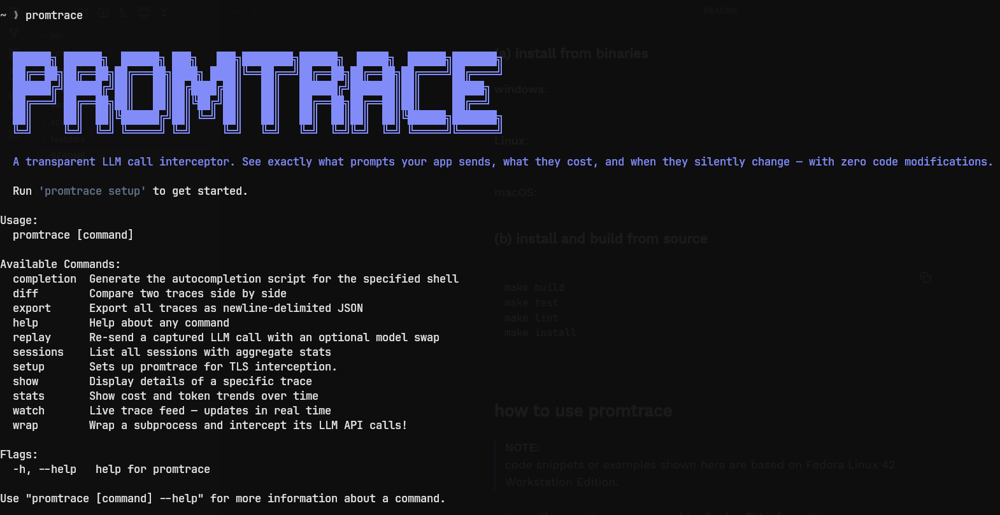
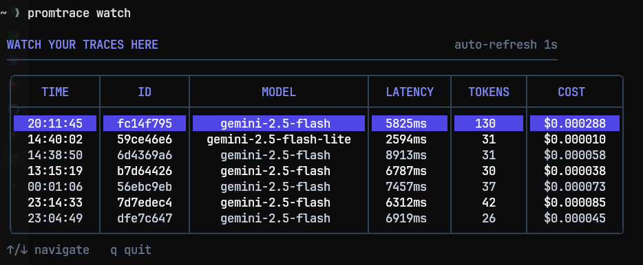
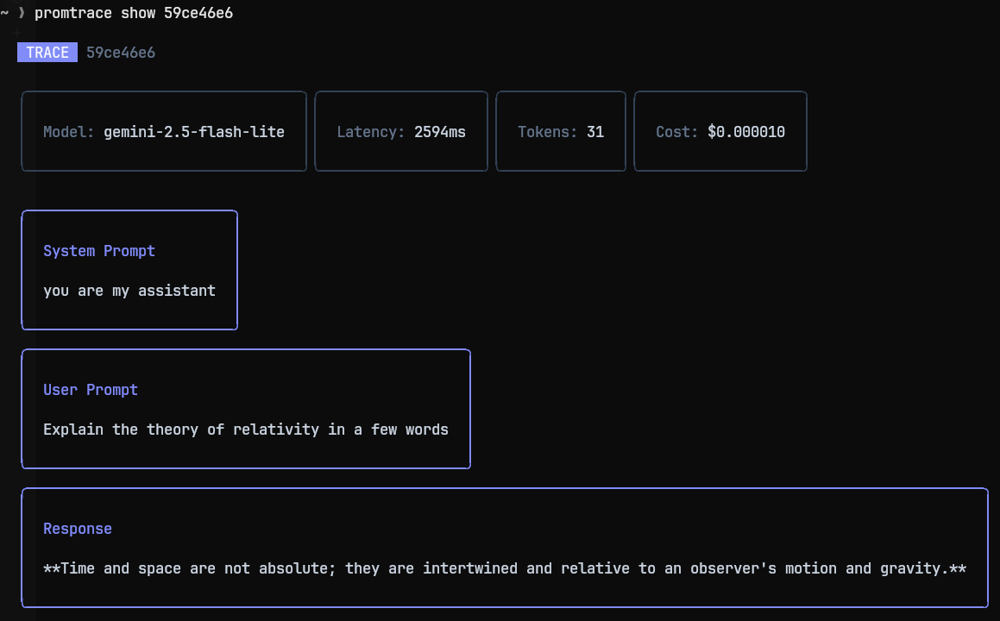
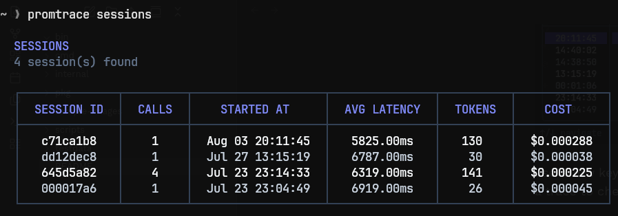
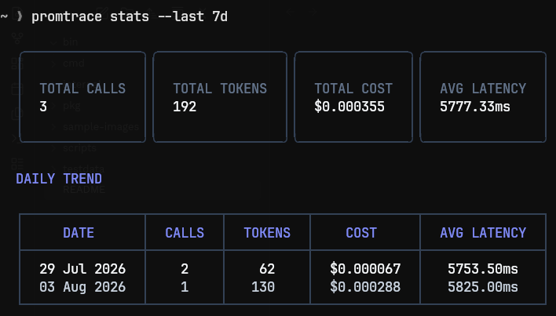
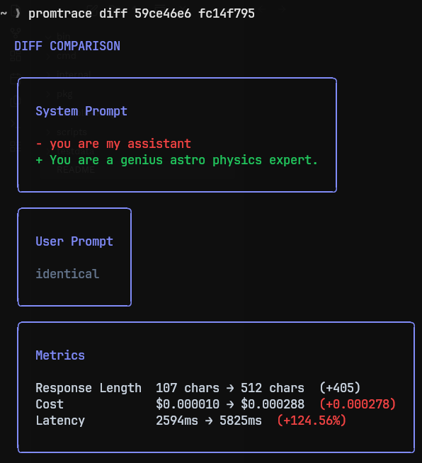
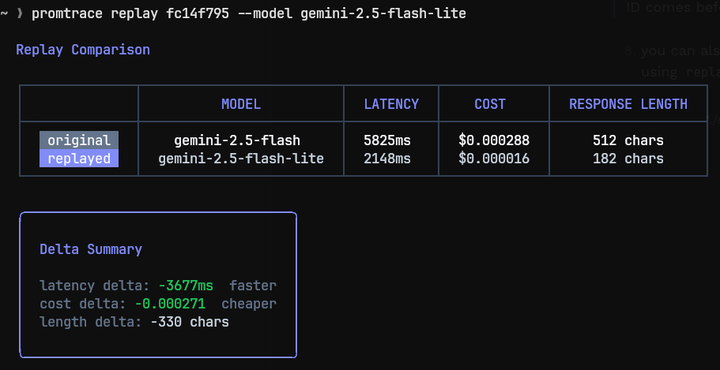

## **promtrace**

promtrace is an LLM call interceptor and a CLI-based LLM observability tool that shows exactly what prompts your app sends, how much they cost, and when they change unexpectedly, without code modifications.

## **prerequisites**

1. go 1.24.5 or later.
2. permission to install a root CA into the OS trust store.
3. SQLite is used as the local trace store via `go-sqlite3`.

## **installation**

#### **(a) install from binaries**

**windows**:

- [**for amd64 machines**](https://github.com/hrpofficial736/promtrace/releases/download/v0.1.0/promtrace-windows-amd64.exe)

**linux**:

- [**for amd64 machines**](https://github.com/hrpofficial736/promtrace/releases/download/v0.1.0/promtrace-linux-amd64)
- [**for arm64 machines**](https://github.com/hrpofficial736/promtrace/releases/download/v0.1.0/promtrace-linux-arm64)

macOS:

- [**for amd64 machines**](https://github.com/hrpofficial736/promtrace/releases/download/v0.1.0/promtrace-darwin-amd64)
- [**for arm64 machines**](https://github.com/hrpofficial736/promtrace/releases/download/v0.1.0/promtrace-darwin-arm64)

> **NOTE:**
> verify the download with the checksums file before running it.

#### **(b) install and build from source**

```
make build
make test
make lint
make install
```


## **how to use promtrace**

> **NOTE:**
> code snippets or examples shown here are based on Fedora Linux 42 Workstation Edition.


1. use the `promtrace` command to display CLI information.




2. run the `setup` command to setup promtrace for TLS interception:

```
> promtrace setup
Enter your password: 
promtrace is ready, get started by wrapping a sub-process.
```


3. wrap your app or a sub-process using `wrap` command:

```
> promtrace wrap python server.py
```

now, promtrace will start intercepting all the LLM calls from your app transparently.


> **NOTE:**
> promtrace will show no outputs of its own, only the stdout from your app will be shown if any.


4. to stream traces in real time, use the `watch` command:




use arrow keys to navigate up and down, press 'q' to quit, and press 'enter' on a trace to check more info about it.


5. to check more info about a trace specifically, use `show` command followed by the ID of that trace:




6. each `wrap` command creates one session, and you can view all sessions with `sessions` command:




7. to check the stats and per day trends for cost, tokens, latency, use the `stats` command with a `--last` flag to specify the duration for which stats should be displayed (e.g., 7d, 24h, 60m, 60s etc.):




8. to compare two traces, use the `diff` command, followed by the id of two traces:




> **NOTE:**
> the trace whose ID comes later will be compared against the trace whose ID comes before.


9. you can also replay a trace with a different model using `replay` command:




> **NOTE:**
> before running replay command, make sure that you have exported the required API key for the model you are using for replay with the appropriate key name: OPENAI_API_KEY, GEMINI_API_KEY or ANTHROPIC_API_KEY.


10. to export your traces into stdout in `json` or `jsonl` format, you can use `export` command with `--format` flag (default: `jsonl`):

```bash
> promtrace export
# traces will be written to stdout in your terminal in default jsonl format.
```

```bash
> promtrace export --format json
# traces will be written to stdout in your terminal in json format.
```

```bash
> promtrace export --format json > traces.json
# you can also redirect the output to a file to save those traces on the disk.
```


## **important note**

to get help related to any command, use:

```bash
> promtrace <command_name> --help
```


## **troubleshooting**

##### **`replay` command issues**

(a) if you are encountering following error:

```bash
✗ could not replay the request. the selected model is either unsupported or does not match the original provider family. please choose a compatible model and try again.
```

then that means either you have written an unsupported model name in the `--model` flag, or the model you have written belongs to a different provider family, use the model from the same family as in the original trace.


(b) if you are encountering above error:

```bash
✗ could not replay the request. please try again.
```

 then that means the required API key is missing from your OS environment variables, export the appropriate API key:

- in case of open ai models, use:

```bash
> export OPENAI_API_KEY=<YOUR OPENAI API KEY>
```

- in case of gemini models, use:

```bash
> export GEMINI_API_KEY=<YOUR GEMINI API KEY>
```

- in case of anthropic models, use:

```bash
> export ANTHROPIC_API_KEY=<YOUR ANTHROPIC API KEY>
```


## **final note**

promtrace will keep getting better, so stay tuned and it is entirely open source, so feel free to contribute to this repository.

enjoy promtrace!
